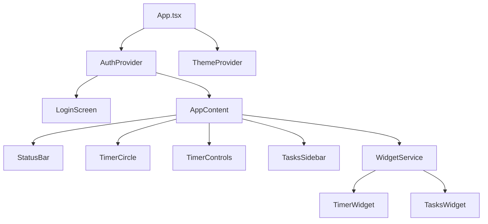

# 🎯 Klar - The Ultimate Focus Timer

<div align="center">


**A powerful, feature-rich Pomodoro timer with OAuth authentication, floating widgets, and comprehensive task management - built with Tauri v2, React, and Rust.**

[](https://tauri.app/)
[](https://reactjs.org/)
[](https://www.typescriptlang.org/)
[](https://www.rust-lang.org/)
[](LICENSE)

</div>

## ✨ Features

### 🚀 **Core Timer Functionality**
- **Pomodoro Technique Integration**: 25-minute focus sessions with customizable break intervals
- **Advanced Timer Controls**: Start, pause, stop, and resume with smooth transitions
- **Visual Progress Tracking**: Beautiful circular progress indicator with real-time updates
- **Break Management**: Automatic break detection with missed/taken break statistics
- **Session Persistence**: Maintains timer state across app restarts

### 🔐 **Authentication & Sync**
- **OAuth2 Integration**: Seamless login with GitHub and Google
- **JWT Token Management**: Secure authentication with automatic token refresh
- **Cross-Device Sync**: Tasks and statistics synchronized across all your devices
- **Offline Mode**: Full functionality without authentication for local use
- **Session Management**: Persistent login state with secure token storage

### 📋 **Task Management**
- **Intelligent Task System**: Create, edit, toggle, and delete tasks with instant sync
- **Real-time Statistics**: Track completion rates, focus time, and productivity metrics
- **Local Storage Fallback**: Tasks persist locally when offline
- **Task-Session Linking**: Associate timer sessions with specific tasks
- **Completion Tracking**: Visual progress indicators and percentage calculations

### 🎨 **System-Wide Widgets**
- **Floating Timer Widget**: Always-on-top timer with drag functionality
- **Tasks Widget**: Compact task overview with quick actions
- **Multi-Window Architecture**: Independent widget windows for maximum flexibility
- **Window State Management**: Automatic positioning and restoration
- **Event-Driven Updates**: Real-time synchronization between main app and widgets

### 🎭 **Modern UI/UX**
- **Dark/Light Theme Support**: Automatic system theme detection with manual override
- **Tailwind CSS**: Modern, responsive design with smooth animations
- **Lucide Icons**: Crisp, consistent iconography throughout the interface
- **Glassmorphism Effects**: Beautiful backdrop blur and transparency effects
- **Responsive Layout**: Optimized for all screen sizes and resolutions

### 📊 **Analytics & Insights**
- **Daily Focus Statistics**: Track total focus time, breaks taken, and missed breaks
- **Session History**: Complete log of all pomodoro sessions with timestamps
- **Productivity Metrics**: Detailed insights into your work patterns
- **Visual Progress**: Real-time charts and completion percentages
- **Export Capabilities**: Data export for external analysis

## 🔧 Tech Stack

### Frontend
- **React 18.3.1** - Modern React with hooks and concurrent features
- **TypeScript 5.6.2** - Type-safe JavaScript for better development experience
- **Tailwind CSS 4.1.11** - Utility-first CSS framework with custom theming
- **Vite 6.0.3** - Lightning-fast build tool and dev server
- **Lucide React** - Beautiful, customizable icon library

### Backend Runtime
- **Tauri v2** - Secure, lightweight desktop app framework
- **Rust** - Memory-safe systems programming language
- **Tokio** - Asynchronous runtime for concurrent operations
- **Serde** - High-performance serialization framework

### Authentication
- **Spring Security OAuth2** - Enterprise-grade authentication
- **JWT Tokens** - Stateless authentication with secure token management
- **GitHub OAuth** - Seamless integration with GitHub accounts
- **Google OAuth** - Universal login with Google accounts

### Build & Development
- **TypeScript Compiler** - Static type checking and modern JS features
- **Tauri CLI** - Development tools and build system
- **npm/pnpm** - Package management and dependency resolution
- **Cross-platform compilation** - Windows, macOS, and Linux support

## 🚀 Quick Start

### Prerequisites

```bash
# Node.js 18+ and npm
node --version  # Should be 18.0.0 or higher
npm --version

# Rust toolchain
curl --proto '=https' --tlsv1.2 -sSf https://sh.rustup.rs | sh
rustc --version

# Tauri CLI
npm install -g @tauri-apps/cli@next
# or
cargo install tauri-cli --version "^2.0.0"
```

### Installation

```bash
# Clone the repository
git clone https://github.com/yourusername/klar.git
cd klar

# Install dependencies
npm install

# Start development server
npm run tauri dev
```

### Build for Production

```bash
# Build the application
npm run tauri build

# The built application will be in src-tauri/target/release/
```

## 📖 Usage Guide

### 🎯 **Getting Started**

1. **Launch Klar** - Start the application from your desktop
2. **Sign In** - Use GitHub or Google OAuth for cloud sync (optional)
3. **Set Your Task** - Enter what you want to focus on
4. **Start Timer** - Click play to begin your 25-minute focus session
5. **Take Breaks** - Follow the Pomodoro technique with automatic break reminders

### ⚡ **Keyboard Shortcuts**

| Key | Action |
|-----|--------|
| `Space` | Start/Pause timer |
| `Escape` | Stop timer |
| `Ctrl/Cmd + N` | New task |
| `Ctrl/Cmd + W` | Toggle timer widget |
| `Ctrl/Cmd + T` | Toggle tasks widget |

### 🎛️ **Advanced Features**

#### **Floating Widgets**
- Create system-wide floating timer and task widgets
- Drag widgets anywhere on your screen
- Widgets stay on top of all other applications
- Independent of main application window

#### **Task Management**
- Add tasks with instant cloud sync
- Mark tasks as complete with visual feedback
- Remove completed tasks to maintain focus
- Track completion percentages in real-time

#### **Statistics Tracking**
- View daily focus time accumulation
- Monitor break compliance and patterns
- Export data for productivity analysis
- Historical session logging

## ⚙️ Configuration

### Environment Variables

Create a `.env` file in the root directory:

```env
# API Configuration
VITE_API_BASE_URL=http://localhost:3001/api

# OAuth Configuration (if using custom backend)
VITE_GITHUB_CLIENT_ID=your_github_client_id
VITE_GOOGLE_CLIENT_ID=your_google_client_id

# Development
VITE_ENV=development
```

### Timer Settings

Customize your Pomodoro intervals in the settings panel:

- **Work Duration**: 25 minutes (default)
- **Short Break**: 5 minutes
- **Long Break**: 15 minutes
- **Sessions Before Long Break**: 4

### Theme Configuration

Klar supports multiple themes:

- **System** - Follows your OS theme preference
- **Light** - Clean, bright interface
- **Dark** - Easy on the eyes for long work sessions

## 🏗️ Architecture

### Project Structure

```
klar/
├── src/                      # React frontend source
│   ├── components/           # Reusable UI components
│   │   ├── widgets/         # Floating widget components
│   │   └── TasksSidebar/    # Task management components
│   ├── contexts/            # React context providers
│   ├── hooks/               # Custom React hooks
│   ├── services/            # API and external services
│   ├── types/               # TypeScript type definitions
│   └── utils/               # Utility functions
├── src-tauri/               # Rust backend source
│   ├── src/                 # Rust source code
│   ├── capabilities/        # Tauri security capabilities
│   ├── icons/               # Application icons
│   └── target/              # Rust build artifacts
├── public/                  # Static assets
└── dist/                    # Built frontend (generated)
```

### Component Architecture



### Data Flow

1. **Authentication**: OAuth providers → JWT tokens → API authentication
2. **Timer State**: React hooks → Tauri commands → Rust state management
3. **Task Management**: React components → API service → Backend sync
4. **Widget Communication**: Event system → Inter-window messaging → State sync

## 🛠️ Development

### Setting Up Development Environment

```bash
# Install development dependencies
npm install

# Start the development server
npm run dev

# In another terminal, start Tauri dev mode
npm run tauri dev

# Run tests
npm test

# Lint code
npm run lint

# Type check
npm run type-check
```

### Adding New Features

1. **Frontend Components**: Add React components in `src/components/`
2. **Rust Commands**: Implement Tauri commands in `src-tauri/src/lib.rs`
3. **API Integration**: Extend services in `src/services/`
4. **Type Safety**: Update interfaces in `src/types/`

### Building Widgets

Widgets are independent Tauri windows that communicate with the main app:

```typescript
// Create a new widget
await widgetService.createTimerWidget();

// Update widget data
await widgetService.updateTimerWidget({
  timeLeft: 1500,
  isActive: true,
  isPaused: false,
  isBreak: false,
  currentTask: "Focus Session"
});

// Close widget
await widgetService.closeTimerWidget();
```

### Rust Command Implementation

```rust
#[tauri::command]
async fn your_command(
    state: State<'_, AppState>,
    app: tauri::AppHandle
) -> Result<YourReturnType, String> {
    // Implementation
    Ok(result)
}
```

## 🧪 Testing

### Running Tests

```bash
# Run all tests
npm test

# Run tests in watch mode
npm run test:watch

# Run tests with coverage
npm run test:coverage

# Test Rust code
cd src-tauri && cargo test
```

### Testing Strategy

- **Unit Tests**: Individual component and function testing
- **Integration Tests**: API and service integration testing
- **E2E Tests**: Full application workflow testing
- **Rust Tests**: Backend logic and command testing

## 📦 Building & Distribution

### Development Build

```bash
npm run tauri dev
```

### Production Build

```bash
# Build for current platform
npm run tauri build

# Build for specific platform
npm run tauri build -- --target x86_64-pc-windows-msvc
```

### Distribution

The built application will be available in:
- `src-tauri/target/release/` - Executable files
- `src-tauri/target/release/bundle/` - Platform-specific installers

## 🤝 Contributing

We welcome contributions! Here's how to get started:

### Contribution Guidelines

1. **Fork the repository**
2. **Create a feature branch**: `git checkout -b feature/amazing-feature`
3. **Commit your changes**: `git commit -m 'Add amazing feature'`
4. **Push to the branch**: `git push origin feature/amazing-feature`
5. **Open a Pull Request**

### Code Standards

- **TypeScript**: Strict type checking enabled
- **ESLint**: Follow the configured linting rules
- **Prettier**: Code formatting enforced
- **Conventional Commits**: Use conventional commit messages

### Development Workflow

```bash
# Install pre-commit hooks
npm run prepare

# Run linting and formatting
npm run lint:fix
npm run format

# Run type checking
npm run type-check

# Run tests before committing
npm test
```

## 🐛 Troubleshooting

### Common Issues

#### **Build Errors**

```bash
# Clear node modules and reinstall
rm -rf node_modules package-lock.json
npm install

# Clear Tauri cache
npm run tauri build -- --config-clear-cache
```

#### **Widget Windows Not Appearing**

1. Check if widgets are enabled in security capabilities
2. Verify widget service initialization
3. Check console for JavaScript errors

#### **Authentication Issues**

1. Verify OAuth provider configuration
2. Check network connectivity
3. Clear browser/app cache and localStorage

#### **Timer Sync Issues**

1. Restart the application
2. Check widget communication logs
3. Verify Tauri command registration

### Debug Mode

Enable debug logging:

```bash
# Set environment variable
export RUST_LOG=debug

# Or in .env file
RUST_LOG=debug
```

## 📄 License

This project is licensed under the MIT License - see the [LICENSE](LICENSE) file for details.

## 🙏 Acknowledgments

- **Pomodoro Technique** - Francesco Cirillo for the time management method
- **Tauri Team** - For the amazing desktop app framework
- **React Team** - For the excellent frontend library
- **Rust Community** - For the powerful systems programming language
- **Contributors** - Everyone who has contributed to making Klar better

## 📞 Support

- **Documentation**: [Wiki](https://github.com/yourusername/klar/wiki)
- **Issues**: [GitHub Issues](https://github.com/yourusername/klar/issues)
- **Discussions**: [GitHub Discussions](https://github.com/yourusername/klar/discussions)
- **Email**: support@klar.app

---

<div align="center">

**Made with ❤️ by the Klar Team**

[⭐ Star this repository](https://github.com/yourusername/klar) if you find it helpful!

</div>
